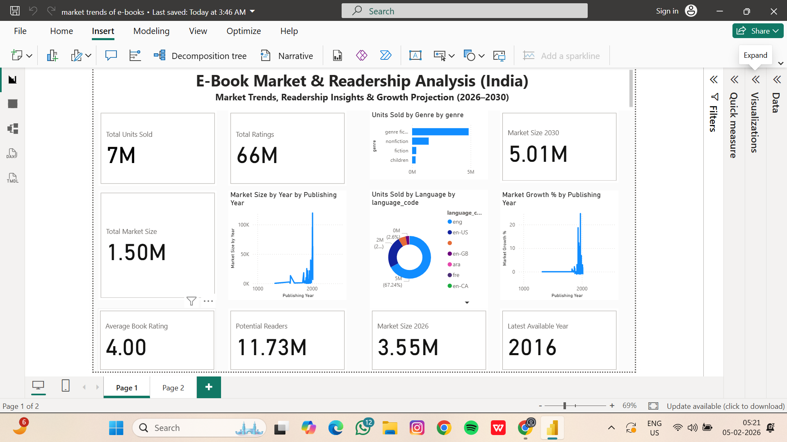

# 📚 E-Book Market & Readership Analysis (India)

This project presents an interactive **Power BI dashboard** that analyzes India’s e-book market using historical book sales and reader engagement data.  
The dashboard highlights readership trends, market growth, and **future market size projections for 2026 and 2030**.
---
## 📸 Dashboard Screenshot

## 🎥 Dashboard Demo Video
[▶️ Watch Dashboard Walkthrough](https://drive.google.com/file/d/1RocGAWFQA7jbmRVsEVoC0xoEUD8YYTnn/view?usp=sharing)

## 🎯 Project Objectives
- Analyze historical e-book readership using sales and ratings data  
- Estimate market size based on gross sales  
- Identify reader preferences by genre and language  
- Project future market size for 2026 and 2030  
- Propose strategies to increase e-book sales in India  
---
## 📂 Dataset Used
**Books_Data_Clean.csv**

The dataset includes:
- Publishing Year  
- Book Name & Author  
- Language Code  
- Book & Author Ratings  
- Genre  
- Units Sold  
- Gross Sales & Publisher Revenue  

> 📌 Note: The dataset contains historical data up to **2016**.
---
## 📊 Key Metrics & KPIs
- Total Units Sold (E-Book Readership Indicator)  
- Total Ratings (Reader Engagement)  
- Total Market Size (Revenue-Based)  
- Average Book Rating  
- Market Growth % (Year-on-Year)  
- **Projected Market Size – 2026**  
- **Projected Market Size – 2030**  
---
## 🧮 Forecasting & DAX Logic
- The **latest available year (2016)** is dynamically detected from the dataset  
- Market size projections are calculated using a **CAGR of 9%**  
- Projections are **estimates**, intended for strategic planning  

> This approach follows standard business forecasting practices.
---
## 📈 Dashboard Insights
- Steady growth in India’s e-book market  
- Fiction and Non-Fiction are the highest-selling genres  
- English dominates e-book consumption, highlighting scope for regional expansion  
- Strong long-term growth potential beyond 2016  
---
## 🚀 Strategies to Increase E-Book Sales (2026–2030)
- Expand regional language content  
- Introduce affordable subscription and student pricing  
- Optimize mobile-first and offline reading experience  
- Use AI-based personalized recommendations  
- Collaborate with authors and digital influencers  
- Run seasonal discounts and bundle offers  
- Focus on high-demand genres  
- Partner with educational institutions  
- Introduce gamification and reader reward systems  
- Integrate e-books with audiobooks and summaries  
---
## 🛠 Tools & Technologies
- Power BI Desktop  
- DAX (Data Analysis Expressions)  
- Power Query (Data Cleaning)  
- CSV Dataset  
---
## 📌 Conclusion
This project demonstrates how historical data combined with DAX-based calculations can generate meaningful business insights and future market projections.  
The dashboard supports **strategic decision-making** for expanding e-book adoption in India.
